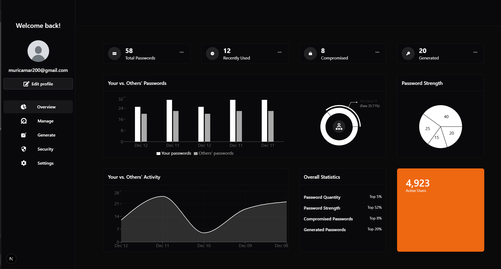
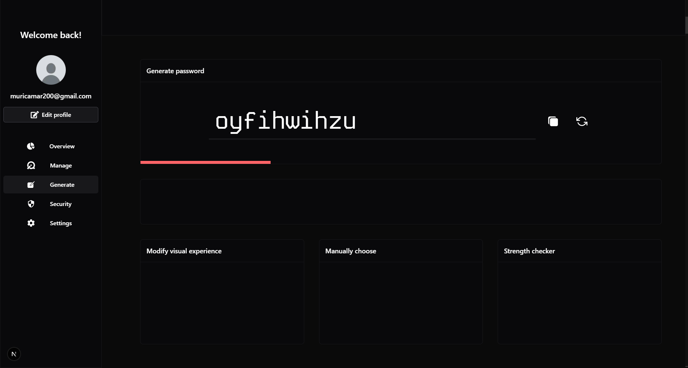
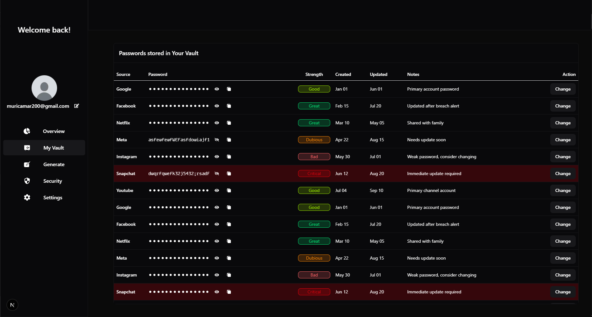

## Next.js Password Manager

# Statistics & General Overview design



# Generating a password design



# The place where you store your passwords design



# It's just a practice project!

— I'm just practicing how to organize folder structure

— How to organize code

— And testing different libraries with next.js

```bash
npm install
```

```bash
npm run dev
```
