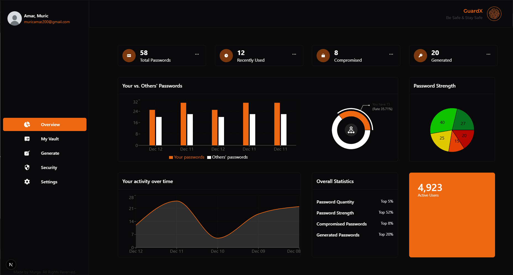
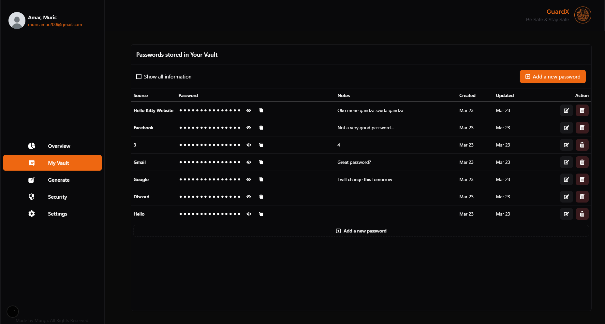
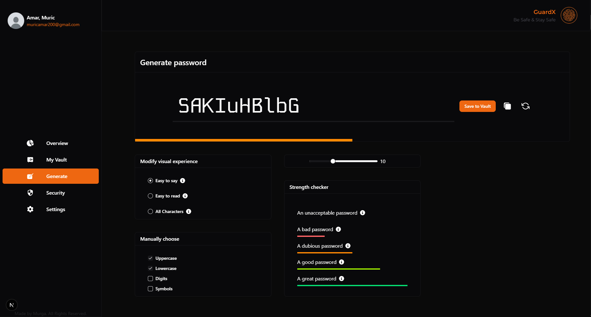

## Next.js Password Manager

# The General Statistics Overview Page



**Features in this page**

- Comparing user's passwords with other user's passwords
- Showing the user the strength of their passwords
- Displaying user's overall statistics
- Displaying user's activity over time

# The User's Vault Page



**Features in this page**

- Displaying the user's services in which they have stored passwords
- Ability to show individual passwords (Only after authenticating themselves)
- Ability to show all information, including the strength and the actual password (After authenticating)
- Ability to copy an individual password (After authenticating)
- Ability to create a new password immediatelly, or to generate a new one

---

# The Generate A Password Page



**Features in this page**

- User gets shown an immediatelly generated password on the first render
- User has full control over the password
- User can choose if they want their password to have
  - Uppercase characters
  - Lowercase characters
  - Digits
  - Symbols
- They can also choose how their password can look based on visibility
  - Easy to say (Only uppercase & lowercase characters)
  - Easy to read (Only uppercase, lowercase & digits)
  - All characters
- User can freely choose how long their password is
- User can also enter their own password in and get feedback on the strength of their password
- User can save their password to their Vault, or choose to only copy the password
- User can regenerate the  password with the same configuartions if they don't like the current generated password

```bash
npm install
```

```bash
npm run dev
```
